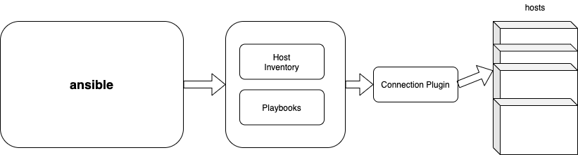

# opensd

#### 介绍
Ansible Deployment for OpenStack

opensd用于批量地脚本化部署openstack各组件服务。

#### 软件架构

opensd基于ansible开发，将openstack各组件的检查、数据库配置、安装前准备、认证、安装过程、安装完成后的配置等细节组织成“剧本”(Playbooks)，同时将各组件以“角色”的形式体现出来，结构清晰易懂，配置简单实用。

用户可以通过修改安装、配置过程中对应的“剧本”就可以实现定制化集群部署。

#### 安装教程

参考 [INSTALL.md](INSTALL.md)

#### 使用说明

参考 [INSTALL.md](INSTALL.md)

#### 参与贡献

1.  Fork 本仓库
2.  新建 Feat_xxx 分支
3.  提交代码
4.  新建 Pull Request

#### 特技

1.  使用 Readme\_XXX.md 来支持不同的语言，例如 Readme\_en.md, Readme\_zh.md
2.  Gitee 官方博客 [blog.gitee.com](https://blog.gitee.com)
3.  你可以 [https://gitee.com/explore](https://gitee.com/explore) 这个地址来了解 Gitee 上的优秀开源项目
4.  [GVP](https://gitee.com/gvp) 全称是 Gitee 最有价值开源项目，是综合评定出的优秀开源项目
5.  Gitee 官方提供的使用手册 [https://gitee.com/help](https://gitee.com/help)
6.  Gitee 封面人物是一档用来展示 Gitee 会员风采的栏目 [https://gitee.com/gitee-stars/](https://gitee.com/gitee-stars/)
